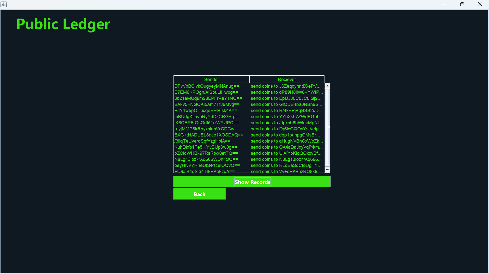

# Blockchain Authentication & Transaction System - Java Project

## Overview

This project is a Java-based application that simulates key concepts of blockchain technology, focusing on authentication, public ledgers, and cryptocurrency transactions. The user interface is built using **Java Swing**, providing a responsive and interactive experience, while **MySQL** is used for managing all backend database operations.

The project draws inspiration from the **Hack The Box** platform, renowned in the cybersecurity community, and follows a similar dark-themed UI style. It showcases an implementation of blockchain-like features using fundamental data structures, notably **Linked Lists**, which simulate the joining and creation of a blockchain network.

## Key Features

- **User Authentication:**  
  Secure login and registration system for users, ensuring only authenticated individuals can access the application.

   
   
- **Public Ledger:**  
  A public, transparent record of all transactions made by users. Each transaction is encrypted and Base64 encoded, ensuring the integrity and security of the data.

   
   
- **Buy & Sell Cryptocurrency:**  
  Users can buy and sell cryptocurrency. They can make transactions using predefined values like 1 coin, 0.25 coins, or any custom value.

   
  
- **Rate with Time Monitoring:**  
  The system tracks cryptocurrency rates over time, allowing users to make informed decisions to buy when the price is low and sell when the price is high.

   
   
- **Transaction Requirement:**  
  To promote user engagement and simulate real-world transaction behavior, users are required to complete at least three transactions before accessing certain functionalities.

   
   
- **Blockchain Simulation:**  
  Users can join the existing blockchain or start their own blockchain chain after completing a verification process. The blockchain is simulated using **Linked Lists**, representing the addition and linking of blocks (transactions) in the chain.
   
## Project Workflow

1. **Login & Signup Page:**  
   The application begins with a login/signup interface, where users can either create a new account or access their existing account.

2. **User Profile:**  
   After successful authentication, the user is redirected to their profile page, which includes options such as:
   - Viewing the public ledger
   - Accessing the buy/sell cryptocurrency section
   - Monitoring currency rates with time

3. **Public Ledger:**  
   The public ledger displays a complete, transparent history of transactions made between users, encrypted and securely stored in the database.

4. **Buy/Sell Cryptocurrency:**  
   Users can purchase and sell coins, with the current rate displayed on a separate page. They must make a minimum of three transactions to unlock certain features in the application.

5. **Currency Rate with Time:**  
   A dynamic page that shows real-time changes in cryptocurrency rates, assisting users in making informed decisions on when to buy or sell.

6. **Start Your Own Blockchain:**  
   Users have the option to start their own blockchain after going through a series of verification steps.

## Technologies Used

- **Programming Language:** Java
- **Frontend Framework:** Java Swing (Responsive UI)
- **Backend Database:** MySQL
- **Data Structure:** Linked List (for Blockchain simulation)
- **Encryption:** Algorithmic encryption with Base64 encoding for transactions

## Learning Outcomes

By completing this project, users will gain a comprehensive understanding of:

1. **Java Programming:**  
   Develop a strong foundation in Java programming, including object-oriented principles and event-driven design.

2. **Java Swing for GUI Development:**  
   Learn how to build responsive and interactive desktop applications using Java Swing.

3. **Database Interaction with MySQL:**  
   Understand how to integrate Java applications with MySQL databases for CRUD (Create, Read, Update, Delete) operations.

4. **Working with Data Structures:**  
   Gain hands-on experience in using data structures like Linked Lists, which are crucial for implementing blockchain-like functionality.

5. **Cryptography Basics:**  
   Learn how to apply basic cryptographic techniques to encrypt and secure data.
   

## Conclusion

This project provides a practical introduction to blockchain technology, covering authentication, transactions, and data encryption in a simulated environment. While not a real-time blockchain implementation, this project offers valuable insights into how blockchain works at a conceptual level. Moreover, it equips users with the technical skills necessary for building Java-based applications that interact with databases, manage transactions, and use fundamental data structures effectively.

